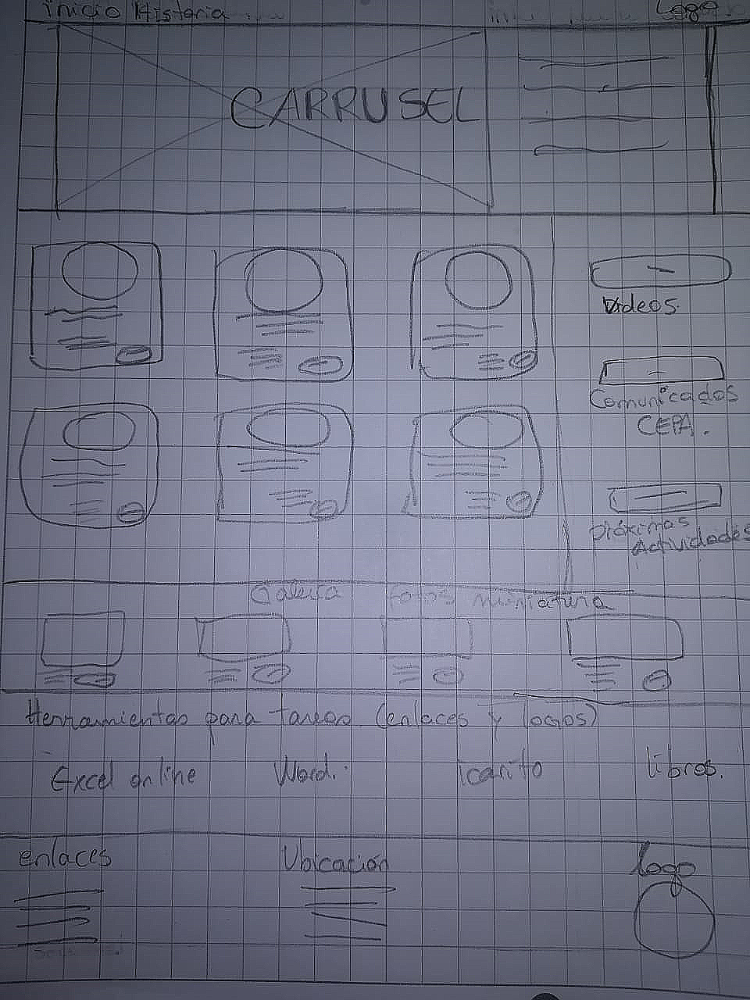
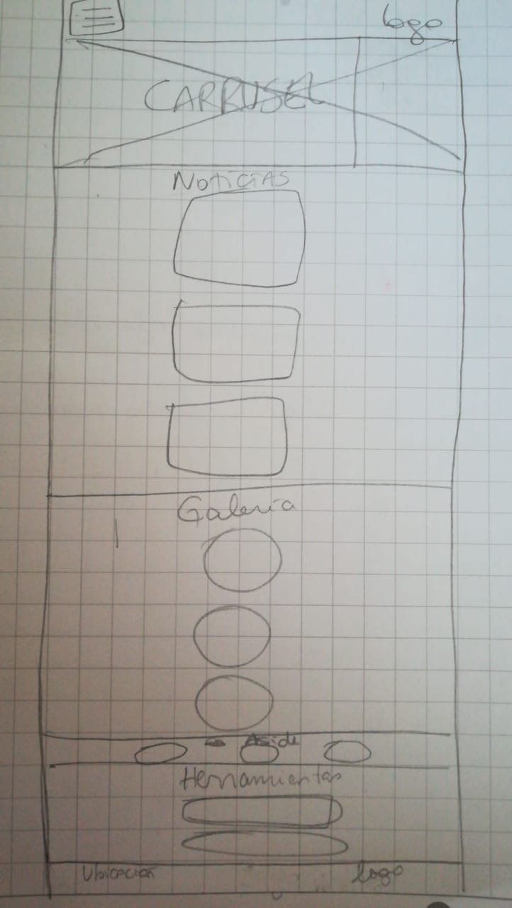

#Instrucciones

1. Trabajar de forma individual.
2. Seleccionar un tema (ver los temas más abajo).
3. Crear un repositorio para el proyecto final (primer commit).
4. Crear el archivo README.md en la raíz del proyecto donde irán descripciones e
instrucciones (segundo commit).
5. Crear la estructura de Directorios (tercer commit).
6. Agregar al archivo readme.md las definiciones escritas de:
El tema seleccionado
Los objetivos para la interfaz (ui) y para la experiencia del usuario (ux).
Los requerimientos del sitio
La definición de layout (tipo de página).
El boceto a mano (como imagen agregada al README.md y a la carpeta
images del directorio (cuarto commit))
7. Realizar un Mockup del home con HTML, CSS y Bootstrap (quinto commit).
8. Versionar todo a través de GIT y gestionarlo por GitHub.

#Desarrollo

##Tema seleccionado:
- Página web de escuela municipal Ana Frank.

##Objetivos para la interfaz (ui):
- La interfaz de usuario debe ser responsiva, tener barra de navegación visible y fija, dialecto sencillo y claro, inteligente y bien estructurada, poder visualizar el material de forma resumida, abrir y cerrar ventanas fácilmente.

##Objetivos para experiencia del usuario (ux):
- La experiencia de usuario debe ser de un sitio web de fácil comprensión de los contenidos, amigable en colores y diseño , además de la distribución de sus componentes que sea facil de entender y sencilla a los ojos del usuario.

##Requerimientos del sitio:
###Requisitos generales:
1. Mostrar a los usuarios sobre la historia de la escuela.
2. Tener una sección de actividades.
3. Tener un organigrama educacional.
4. Página web deberá ser responsiva.
5. Galería de fotos.
6. Noticias y contacto.

###Requerimientos técnicos:

- Sitio web debe contener 4 secciones, 1 aside, navbar y footer.

1. El logo y una barra de navegación.
2. Debe mostrar imágenes relacionadas con la escuela.
3. Debe tener una sección "Historia".
4. Debe tener enlaces a herramientas que faciliten las tareas.
5. Debe tener un footer con ubicación, logo y enlaces a las páginas del header.

- Se ultilizara herramientas de desarrollo:
1. Bootstrap 4
2. jquery version 3.3.1
3. Font Awesome 5
4. Google Fonts

###Requerimientos visuales:

1. Colores:
   -#777777
   -#CBEB92
   -#93ead9
   -#ffffff
   -#33383b
   -#5383d3
   -#92999f
   -#33383b
   -#1e456d

2. Fuentes:
   -Raleway-Bold.ttf
   -Raleway-ExtraLight.ttf
   -OpenSans-Regular.ttf

3. Imagenes:
   - Proporcionadas por alumnos, apoderados y direción de la escuela.

##Definición de layout:

##Boceto:
Sketch Escritorio

Sketch Mobile

##Descripción Layout:
- Seré una mezcla de sitio corporativo y un portal.

###Estructura HTML:

1. La estructura debe estar compuesta por :
   - 1 nav
       - Contiene logo y menú de navegación.

   - 1 header
       - Contiene imagenes con parrafos a la derecha y a la izquierda.

   - 3 section
       - Primera sección: Noticias en miniatura, 2 filas con 3 columnas.
       - Segunda sección: Galería de fotos en miniatura.
       - Tercera sección: Contine enlaces para herramientas online que faciliten las tareas de los alumnos, material didáctico.
   - 1 aside
       - Contiene botones con enlaces a comunicados de CEPA,próximas actividades, videos de colegio.

   - 1 footer
       - Contiene logo a la izquierda + ubicación al centro + enlaces de interés a la derecha. 

